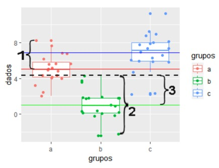

```{r, echo=FALSE, out.width = '60%'}
#knitr::include_graphics("resolucao_exercicio1.png")
``` 

# Exercicio 1 (1,5 ponto)

**Encontre os EMQ de $\beta_0$ e $\beta_1$, calcule o valor esperado desses estimadores. Calcule a $Var(\hat{\beta}_1)$.**

Resposta:

Para encontrar os EMQ de $\beta_0$ e $\beta_1$, precisamos encontrar os valores destes 
que minimizem a soma dos desvios ao quadrado. A soma dos quadrados dos desvios das
observações em relação a reta é dada por

$L=\displaystyle\sum_{i=1}^n\epsilon_i^2=\displaystyle\sum_{i=1}^n(y_i-\beta_0-\beta_1x_i)^2$

Então, definimos $\hat{\beta_0}$ e $\hat{\beta_1}$ os EMQ de $\beta_0$ e $\beta_1$. Queremos
encontrar os valores de $\beta_0$ e $\beta_1$ que minimizam o erro. Então, fazemos isso
derivando e igualando a zero.

$\hat{\beta_0}$ e $\hat{\beta_1}$ devem satisfazer:

$\displaystyle\frac{\partial L}{\partial\beta_0}\bigg|_{\hat{\beta_0},\hat{\beta_1}}=$
$-2\displaystyle\sum_{i=1}^n(y_i-\hat{\beta_0}-\hat{\beta_1}x_i)=0$

$\displaystyle\frac{\partial L}{\partial\beta_1}\bigg|_{\hat{\beta_0},\hat{\beta_1}}=$
$-2\displaystyle\sum_{i=1}^n(y_i-\hat{\beta_0}-\hat{\beta_1}x_i)x_i=0$

Simplificando essas equações, temos que:

$n\hat{\beta_0}+\hat{\beta_1}\displaystyle\sum_{i=1}^nx_i=\displaystyle\sum_{i=1}^ny_i$

$\hat{\beta_0}\displaystyle\sum_{i=1}^nx_i+\hat{\beta_1}\displaystyle\sum_{i=1}^nx_i^2=$
$\displaystyle\sum_{i=1}^ny_ix_i$

Essas equações são chamadas de equações normais. Elas dependem dos dados somente através
de estatísticas suficientes. A solução dessas equações resulta nos estimadores $\hat{\beta_0}$
e $\hat{\beta_1}$.

A estimativa de mínimos quadrados do intercepto é dada por

$\hat{\beta_0}=\overline{y}-\hat{\beta_1}\overline x$.

A estimativa da inclinação é dada por

$\hat{\beta_1}=\displaystyle\frac{\sum_{i=1}^ny_ix_i-\frac{(\sum_{i=1}^ny_i)(\sum_{i=1}^nx_i)}{n}}{\sum_{i=1}^nx_i^2-\frac{(\sum_{i=1}^nx_i)^2}{n}}$

Em que

$\overline{y}=\displaystyle\frac{\sum_{i=1}^ny_i}{n}$ e $\overline{x}=\displaystyle\frac{\sum_{i=1}^nx_i}{n}$.

O $\hat{\beta_1}$ da equação anterior também pode ser definido como:

$\hat{\beta_1}=\displaystyle\frac{\sum_{i=1}^n(y_i-\overline{y})(x_i-\overline{x})}{\sum_{i=1}^n(x_i-\overline{x})^2}=\displaystyle\frac{S_{xy}}{S_{xx}}$

Vejamos as demonstrações dos resultados:

Para $S_{xx}$:

$S_{xx}=\displaystyle\sum_{i=1}^n(x_i-\overline{x})^2=\displaystyle\sum_{i=1}^n(x_i^2-2\overline{x}x_i+\overline{x}^2)$

$=\displaystyle\sum_{i=1}^nx_i^2-2\overline{x}\displaystyle\sum_{i=1}^nx_i+n\overline{x}^2=\displaystyle\sum_{i=1}^nx_i^2-2n\overline{x}^2+n\overline{x}^2$

$=\displaystyle\sum_{i=1}^nx_i^2-n\overline{x}^2=\displaystyle\sum_{i=1}^nx_i^2-n\left(\displaystyle\frac{\sum_{i=1}^nx_i}{n}\right)^2$

$=\displaystyle\sum_{i=1}^nx_i^2-\displaystyle\frac{(\sum_{i=1}^nx_i)^2}{n}$

Para $S_{xy}$:

$S_{xy}=\displaystyle\sum_{i=1}^n(y_i-\overline{y})(x_i-\overline{x})=\displaystyle\sum_{i=1}^n(y_ix_i-y_i\overline{x}-\overline{y}x_i+\overline{y}\overline{x})$

$=\displaystyle\sum_{i=1}^ny_ix_i-\overline{x}\displaystyle\sum_{i=1}^ny_i-\overline{y}\displaystyle\sum_{i=1}^nx_i+n\overline{x}\overline{y}$

$=\displaystyle\sum_{i=1}^ny_ix_i-n\overline{x}\overline{y}-n\overline{x}\overline{y}+n\overline{x}\overline{y}$

$=\displaystyle\sum_{i=1}^ny_ix_i-n\overline{x}\overline{y}=\displaystyle\sum_{i=1}^ny_ix_i-n\displaystyle\frac{\sum_{i=1}^nx_i\sum_{i=1}^ny_i}{n^2}=\displaystyle\sum_{i=1}^ny_ix_i-\displaystyle\frac{\sum_{i=1}^nx_i\sum_{i=1}^ny_i}{n}$

Agora, vamos calcular o valor esperado dos estimadores. Para $E[\hat{\beta_0}]$, temos:

$E(\hat{\beta_0})=E[\overline{Y}-\hat{\beta_1}\overline{X}]=E[\overline{Y}]-E[\hat{\beta_1}\overline{X}]=\displaystyle\frac{1}{n}E\left[\displaystyle\sum_{i=1}^nY_i\right]-\overline{X}E[\hat{\beta_1}]$

$=\displaystyle\frac{1}{n}\displaystyle\sum_{i=1}^nE[Y_i]-\beta_1\overline{X}=\displaystyle\frac{1}{n}\displaystyle\sum_{i=1}^n(\beta_0+\beta_1X_i)-\beta_1\overline{X}$

$=\beta_0+\beta_1\overline{X}-\beta_1\overline{X}=\beta_0$

Para $E[\hat{\beta_1}]$, sabemos que:

$\displaystyle\sum_{i=1}^n(X_i-\overline{X})(Y_i-\overline{Y})=\displaystyle\sum_{i=1}^n(X_i-\overline{X})Y_i-\overline{Y}\displaystyle\sum_{i=1}^n(X_i-\overline{X})=\displaystyle\sum_{i=1}^n(X_i-\overline{X})Y_i$

pois $\overline{Y}\displaystyle\sum_{i=1}^n(X_i-\overline{X})=0.$

Temos então que:

$E[\hat{\beta_1}]=E\left[\displaystyle\frac{\sum_{i=1}^n(X_i-\overline{X})(Y_i-\overline{Y})}{\sum_{i=1}^n(X_i-\overline{X})^2}\right]=\displaystyle\frac{E[\sum_{i=1}^n(X_i-\overline{X})Y_i]}{\sum_{i=1}^n(X_i-\overline{X})^2}$

$=\displaystyle\frac{[\sum_{i=1}^n(X_i-\overline{X})E(Y_i)]}{\sum_{i=1}^n(X_i-\overline{X})^2}=\displaystyle\frac{[\sum_{i=1}^n(X_i-\overline{X})(\beta_0+\beta_1X_i)]}{\sum_{i=1}^n(X_i-\overline{X})^2}=\displaystyle\frac{\sum_{i=1}^n(X_i-\overline{X})\beta_0+\beta_1\sum_{i=1}^n(X_i-\overline{X})X_i}{\sum_{i=1}^n(X_i-\overline{X})^2}$

mas

$\displaystyle\sum_{i=1}^n(X_i-\overline{X})=0$

$\displaystyle\sum_{i=1}^n(X_i-\overline{X})X_i-\overline{X}\displaystyle\sum_{i=1}^n(X_i-\overline{X})=\displaystyle\sum_{i=1}^n(X_i-\overline{X})^2$

Logo

$E[\hat{\beta_1}]=\displaystyle\frac{0\beta_0}{\sum_{i=1}^n(X_i-\overline{X})^2}+\beta_1\displaystyle\frac{\sum_{i=1}^n(X_i-\overline{X})^2}{\sum_{i=1}^n(X_i-\overline{X})^2}=\beta_1$

Ou seja, temos que $E[\hat{\beta_0}]=\beta_0$ e $E[\hat{\beta_1}]=\beta_1$.

Agora, para o cálculo de $Var(\hat{\beta}_1)$, temos:

$Var(\hat{\beta}_1)=Var\left[\displaystyle\frac{\sum_{i=1}^n(X_i-\overline{X})Y_i}{\sum_{i=1}^n(X_i-\overline{X})^2}\right]=\displaystyle\frac{Var[\sum_{i=1}^n(X_i-\overline{X})Y_i]}{[\sum_{i=1}^n(X_i-\overline{X})^2]^2}$

$=\displaystyle\frac{\sum_{i=1}^n(X_i-\overline{X})^2Var[Y_i]}{[\sum_{i=1}^n(X_i-\overline{X})^2]^2}=\displaystyle\frac{\sum_{i=1}^n(X_i-\overline{X})^2\sigma^2}{[\sum_{i=1}^n(X_i-\overline{X})^2]^2}$

$Var(\hat{\beta}_1)=\displaystyle\frac{\sigma^2}{\sum_{i=1}^n(X_i-\overline{X})^2}$

# Exercicio 2 (0,5 pontos)

**Encontre os estimadores de máxima verossimilhança de $\beta_0$ e $\beta_1$, cite algumas das propriedades desses estimadores.**

Nosso modelo é

$Y_i = \beta_0+\beta_1x_i+\epsilon_i$

em que $\epsilon_i\sim N(0,\sigma^2)$.

Então, a media e a variância de cada $Y_i$ são respectivamente $E[Y_i|X_i=x_i]=\beta_0+\beta_1x_i$ e $Var[Y_i|X_i=x_i]=\sigma^2$.

Adicionalmente, o $Y_i$ segue uma distribuição normal condicionada sobre os valores $x_i$.

$Y_i|X_i\sim N(\beta_0+\beta_1x_i,\sigma^2)$

Então, devemos relembrar que se a função distribuição de probabilidade de uma variavável aleatória $Z\sim N(\mu,\sigma^2)$, sua função densidade de probabilidade é dada por

$f_Z(z/\mu,\sigma^2)=\displaystyle\frac{1}{\sqrt{2\pi\sigma^2}}\exp\left[-\displaystyle\frac{1}{2}\left(\displaystyle\frac{z-\mu}{\sigma}\right)^2\right]$

Então, podemos escrever a fdp de cada uma das v.a. $Y_i$ como

$f_{Y_i}(y_i/x_i,\beta_0,\beta_1,\sigma^2)=\displaystyle\frac{1}{\sqrt{2\pi\sigma^2}}\exp\left[-\displaystyle\frac{1}{2}\left(\displaystyle\frac{y_i-(\beta_0+\beta_1x_i)}{\sigma}\right)^2\right]$

Assumindo que os erros são independentes, a função de verossimilhança fica dada pelo produto de funções densidade de probabilidade normais avaliadas nas $n$ observações $(x_i,y_i)$. A verossimlhança desse modelo, será função dos três parâmetros $\beta_0, \beta_1,$ e $\sigma^2$.

$L(\beta_0,\beta_1,\sigma^2)=\displaystyle\prod_{i=1}^n\displaystyle\frac{1}{\sqrt{2\pi\sigma^2}}\exp\left[-\displaystyle\frac{1}{2}\left(\displaystyle\frac{y_i-(\beta_0+\beta_1x_i)}{\sigma}\right)^2\right]$

O objetivo é encontrar valores de $\beta_0, \beta_1,$ e $\sigma^2$ que maximizem essa função, que é um problema de maximização multivariada.
A equação acima, também pode ser vista como:

$L(\beta_0,\beta_1,\sigma^2)=\left(\displaystyle\frac{1}{\sqrt{2\pi\sigma^2}}\right)^n\exp\left[-\displaystyle\frac{1}{2\sigma^2}\displaystyle\sum_{i=1}^n(y_i-\beta_0-\beta_1x_i)^2\right]$

Agora, utilizamos o logaritmo natural por conveniência matemática, já que o $\log$ é uma função monotonicamente crescente. Então maximizar o $\log$ da verossimilhança vai gerar as mesmas estimativas que maximizar a verossimilhança.

$\log L(\beta_0,\beta_1,\sigma^2)=-\displaystyle\frac{n}{2}\log(2\pi)-\displaystyle\frac{n}{2}\log(\sigma^2)-\displaystyle\frac{1}{2\sigma^2}\displaystyle\sum_{i=1}^n(y_i-\beta_0-\beta_1x_i)^2$

Agora, calculamos as derivadas parciais com relação aos parâmetros que temos. Nesse caso, faremos a derivada parcial porque ela que maximiza a função. Então, temos:

$\displaystyle\frac{\partial\log L(\beta_0,\beta_1,\sigma^2)}{\partial\beta_0}=\displaystyle\frac{1}{\sigma^2}\displaystyle\sum_{i=1}^n(y_i-\beta_0-\beta_1x_i)$

$\displaystyle\frac{\partial\log L(\beta_0,\beta_1,\sigma^2)}{\partial\beta_1}=\displaystyle\frac{1}{\sigma^2}\displaystyle\sum_{i=1}^n(x_i)(y_i-\beta_0-\beta_1x_i)$

Igualando cada uma das derivadas parciais à zero e resolvendo o sistema resultante de equações:

$\displaystyle\sum_{i=1}^n(y_i-\beta_0-\beta_1x_i)=0$

$\displaystyle\sum_{i=1}^n(x_i)(y_i-\beta_0-\beta_1x_i)=0$

Podemos notar que as duas primeiras equações também aparecem na estimação por mínimos quadrados. Dados que esses valores são o máximo da função de verossimilhança, encontramos as estimativas de máxima verossimilhança.

$\hat{\beta_1}=\displaystyle\frac{\sum_{i=1}^nx_iy_i-\frac{(\sum_{i=1}^nx_i)(\sum_{i=1}^ny_i)}{n}}{\sum_{i=1}^nx_i^2-\frac{(\sum_{i=1}^nx_i)^2}{n}}=\displaystyle\frac{S_{xy}}{S_{xx}}$

$\hat{\beta_0}=\overline{y}-\hat{\beta_1}\overline{x}$

Podemos notar que $\hat{\beta_0}$ e $\hat{\beta_1}$ são iguais aos estimadores de mínimos quadrados.

Agora, será citado algumas propriedades desses estimadores:

Os estimadores de máxima verossimilhança são **ASSINTOTICAMENTE**:

- EFICIENTES: sua variância atinge o limite inferior de Cramér-Rao.
- CONSISTENTES: seu valor esperado se aproxima do parâmetro quando o tamanho da amostra aumenta (são assintoticamente não-viciados).
- NORMAIS: a distribuição do estimador se aproxima da distribuição normal, não importa quão complicado é o modelo gerador dos dados.

Além dessas propriedades assintóticas, os EMV possuem a propriedade:

- SUFICIÊNCIA: contêm toda a informação sobre o parâmetro contida na amostra.
- INVARIÂNCIA: permite calcular o EMV de uma função do parâmetro populacional, desde que a função real seja invertível. Ex.: $\hat{\theta}$ é o EMV de $\theta$ e $\exp(\hat{\theta})$ é o EMV de $\exp(\theta)$.

# Exercicio 3 (0,5 pontos)

**Responda Verdadeiro ou Falso e justifique a sua resposta:**

**a) Os estimadores de MQO são consistentes, isso significa que as suas esperanças são iguais aos verdadeiros valores dos parâmetros.**

Falso. Os estimadores de MQO são consistentes, mas isso significa que quanto maior o n, menor a sua variância, ou seja, maior a sua precisão. A consistência não significa que as esperanças sejam iguais aos verdadeiros valores dos parâmetros.

**b) Os estimadores MQO são lineares e não tendenciosos, mas existem outros estimadores lineares não tendenciosos mais precisos.**

Falso. Os estimadores MQO são lineares, não tendenciosos e têm variância mínima dentre todos os estimadores lineares não viciados. Ou seja, são os melhores estimadores lineares não viciados de seus respectivos parâmetros.
	
**c) Para utilizar os estimadores de MQO, deve-se supor que os resíduos tenham distribuição normal.**

Verdadeiro. Uma das suposições é que os erros são identicamente distribuídos com distribuição $N(0,\sigma^2)$, ou seja, todos os erros $\epsilon_i$ foram gerados de uma mesma normal, com mesma média e variância.

**d) Quando maior a variância residual estimada, maior a dispersão dos valores de Y em relação à reta de regressão estimada.**

Verdadeiro. Quanto maior a variância residual, os valores de Y estarão mais dispersos em relação à reta de regressão. Isso tem relação com a soma de quadrados totais, já que quanto maior a variância residual, menor a soma de quadrados da regressão e maior a soma de quadrados dos resíduos, e isso afeta na variação dos valores de Y na amostra.

**e) Heterocedasticidade ocorre quando o erro aleatório em um modelo de regressão é correlacionado com uma das variáveis explicativas.**
	
Falso. A heterocedasticidade ocorre quando os resíduos não se distribuem aleatoriamente em torno de zero, e se observa algum padrão no valor dos resíduos, ou seja, não precisa estar correlacionado com uma das variáveis explicativas.

# Exercicio 4 (0,5 pontos)

**Comente sobre as seguintes afirmações:**

**a) O p-valor é a probabilidade que a hipótese nula seja verdade.**

O p-valor não é a probabilidade que a hipótese nula seja verdade. O p-valor é a probabilidade de se obter os resultados encontrados na amostra, com a hipótese nula sendo verdadeira.

**b) O p-valor é uma medida de evidência prática.**

Não podemos afirmar essa frase. Nem todo p-valor calculado em um teste nos diz tudo sobre a amostra, normalmente precisamos de um contexto pra saber o que estamos fazendo, pois somente com o teste e o p-valor não é possível afirmar nada sobre a amostra. 

# Exercicio 5 (0,5 pontos)

**Como a soma de quadrados da regressão pode ser dividida? Esboce os gráficos e indique o que significa cada uma dessas divisões.**

A soma de quadrados da regressão pode ser dividida em três partes. A primeira é a Soma de Quadrados Totais (SQT), que mede a variação dos valores de Y na amostra. A segunda parte é a Soma de Quadrados da Regressão (SQR), que mede o quanto da SQT é explicada pelo modelo de regressão ajustado. Por último, temos a Soma de Quadrados dos Resíduos (SQE), que mede o quanto da SQT não é explicada pelo modelo de regressão ajustado. A soma de quadrado total é decomposta dessa forma

$SQT=SQR+SQE$

$\displaystyle\sum_{i=1}^n(Y_i-\overline{Y})^2=\displaystyle\sum_{i=1}^n(\hat{Y_i}-\overline{Y})^2+\displaystyle\sum_{i=1}^n(Y_i-\hat{Y_i})^2$

Abaixo, temos um gráfico que mostra o quanto a SQT é explicada pela SQR:

```{r, echo=FALSE, out.width = '60%'}

```

A diferença dos pontos em relação a reta vermelha é como é calculado a Soma de Quadrados dos Resíduos, a diferença da reta vermelha em relação a reta laranja é como é calculado a Soma de Quadrados da Regressão e a diferença dos pontos pra reta laranja é a Soma de Quadrados Totais. Ou seja, quanto maior a SQR, maior a explicação de SQT pelo modelo de regressão ajustado.

# Exercicio 6 (0,5 pontos)

**Como a soma de quadrados da análise de variância pode ser dividida? Esboce os gráficos e indique o que significa cada uma dessas divisões.**

Podemos dividir a soma de quadrados da análise de variância em três partes. Primeiro, temos a Soma de quadrados dentro (SQDentro), que mede as diferenças entre as $n_i$ observações do grupo $i$ e a média deste mesmo grupo $i$ $\overline{y}_i$. Temos também a Soma de quadrados total (SQT) que mede as diferenças entre as $N$ observações e a média geral da amostra $\overline{y}$. E por último, temos a Soma de Quadrados Entre (SQEntre), que mede a diferença entre as médias dos grupos $\overline{y}_i$ e a média amostral $\overline{y}$.A soma de quadrado total é decomposta dessa forma

$SQT = SQEntre + SQDentro$

$\displaystyle\sum_{i=i}^g\displaystyle\sum_{j=1}^{n_i}(Y_{ij}-\overline{Y})^2=\displaystyle\sum_{i=i}^g\displaystyle\sum_{j=1}^{n_i}(\overline{y}_i-\overline{y})^2+\displaystyle\sum_{i=i}^g\displaystyle\sum_{j=1}^{n_i}(y_{ij}-\overline{y}_i)^2$

Abaixo, temos um gráfico mostrado em aula pela professora para entendermos melhor cada parte da soma de quadrados:

```{r, echo=FALSE, out.width = '60%'}

``` 

1) **SQDentro**: mesmo que a soma de quadrados dos resíduos (SQErro) em um modelo de regressão linear simples.

- Pois, queremos que a diferença quadrática entre o valor observado $y_{ij}$ e o valor predito $\overline{y}_i$ seja pequena.

2) **SQT**: mesmo que a soma de quadrados totais (SQT) do modelo de regressão linear simples.

- É a variabilidade dos dados.

3) **SQEntre**: o mesmo que a soma de quadrados da Regressão (SQR) no modelo de regressão linear simples.

- Mede o quanto a média do grupo $\hat{y}_i$ é diferente da média geral $\overline{y}$, ou seja, quanto o modelo está contribuindo para uma melhor predição de $y_{ij}$.

# Exercicio 7 (2 pontos)

**Para o exercício utilize as variáveis _Income_ e _Ethnicity_  do banco de dados *Credit* do pacote *ISLR*.**

```{r, echo=FALSE, message=FALSE, warning=FALSE}
library(tidyverse)
library(dplyr)
library(GGally)
library(ggfortify)
library(ggplot2)
library(knitr)
library(ggfortify)
library(HistData)
library(plotly)
library(tidyr)
library(pastecs)
library(gridExtra)
library(lmtest)
library(nortest)
library(ISLR)
library(agricolae)
library(mosaic)
library(gmodels)
library(kableExtra)
```

**a) Faça um teste de hipóteses para comparar o rendimento médio entre as diferentes etnias. Interprete os resultados do teste. Qual a sua conclusão.**

```{r}
Credit <- Credit %>%
  select(Income, Ethnicity)

Credit$Ethnicity <- as.factor(Credit$Ethnicity)
modelo1 = lm(Credit$Income ~ Credit$Ethnicity, data = Credit)
modelo1

summary(modelo1)

tabela_anova_modelo1 = anova(modelo1)
tabela_anova_modelo1

anova_modelo1 = aov(modelo1)
anova_modelo1
```

Como podemos ver acima, de acordo com o teste F da ANOVA, temos que o p-valor é igual a $0.724$, o que nos diz que devemos aceitar a hipótese nula de que o rendimento médio é igual para todas as etnias.

**b) Alguma das etnias possui uma renda superior as outras? Justifique.**

```{r, out.width = '60%'}
medias_modelo1<-with(Credit, tapply(Income, Ethnicity, mean))
medias_modelo1

ci(modelo1, confidence = 0.95)

ggplot(Credit, mapping = aes(x = Ethnicity, y = Income, colour = Ethnicity)) +
  geom_boxplot(aes(fill = Ethnicity), alpha= 0.2)+
  geom_jitter(width = 0.2)+
  geom_hline(aes(yintercept = mean(Income)), color = "black", size=0.7)+
  ggtitle("Boxplot da amostra")

TukeyHSD(modelo1)

par(oma=c(0,5,0,0)) # ajusta as margens

plot(TukeyHSD(modelo1, conf.level = 0.95),las=1, col = "red")
```

Nos baseando a partir das médias, temos que a etnia Africano Americano é um pouco maior que as outras médias. Porém, analisando o boxplot, não podemos dizer isso, já que temos amostras com variâncias bastante parecidas, e as médias estão bem aproximadas. O teste de hipótese reforça essa ideia também, já que aceitamos a hipótese nula de que as médias são iguais.

O teste Tukey para comparações múltiplas também nos mostra, comparando as médias 2 a 2, que todas as diferenças contém o zero no intervalo. Isso reforça o teste de hipóteses afirmando nossa hipótese nula.

**c) Faça análise dos resíduos do modelo acima.**

```{r, message=FALSE, warning=FALSE}

##Normalidade
residuos1 <- residuals(modelo1)
shapiro.test(residuos1)


ggplot()+
  geom_histogram(mapping = aes(residuos1))

autoplot(modelo1, which = 2, ncol = 2, label.size = 3)

norm.test.stat = c(shapiro.test(modelo1$residuals)$statistic, 
                   ks.test(modelo1$residuals, "pnorm")$statistic, 
                   ad.test(modelo1$residuals)$statistic, 
                   cvm.test(modelo1$residuals)$statistic)

norm.test.pvalue = c(shapiro.test(modelo1$residuals)$p.value, 
                   ks.test(modelo1$residuals, "pnorm")$p.value, 
                   ad.test(modelo1$residuals)$p.value, 
                   cvm.test(modelo1$residuals)$p.value)

norm.test = cbind(norm.test.stat, norm.test.pvalue)

rownames(norm.test) = c("Shapiro-Wilk", "Kolmogorov-Smirnov", 
                        "Anderson-Darling", "Cramer-Von-Mises")
colnames(norm.test) = c("Statistic", "P.value")

kable(round(norm.test,4), align = "c", caption = "Testes de normalidade")
```

Conforme podemos ver, o nosso histograma não nos mostra uma cara de distribuição normal. Também dizemos, com base no qqplot, que os resíduos não tem distribuição normal. Por fim, todos os testes feitos rejeitam a hipótese nula de normalidade dos dados. 

Ou seja, com essas evidências, podemos dizer que os resíduos desse modelo não seguem distribuição normal.

```{r, message=FALSE, warning=FALSE}
#Homocedasticidade

ggplot(modelo1, aes(.fitted, .resid))+
  geom_point()+
  stat_smooth(method="loess")+
  geom_hline(yintercept=0, col="red", linetype="dashed")+
  xlab("Valores ajustados")+ylab("Residuos")+
  ggtitle("Residuos vs Ajustados")+
  theme_bw()

ggplot(Credit, mapping = aes(y = residuos1, x = Ethnicity)) +
  geom_point()+
  geom_hline(yintercept = 0, col = "blue", size = 2) +
  ggtitle("Resíduos x Diferentes etnias (Covariável X)")

homo.test = cbind(bptest(modelo1, studentize = FALSE)$statistic, 
                  bptest(modelo1, studentize = FALSE)$p.value)

rownames(homo.test) = c("Breusch-Pagan")
colnames(homo.test) = c("Statistic", "P.value")

kable(homo.test, align = "c", caption = "Teste de homocedasticidade")

```

A variância dos diferentes grupos de etnia parecem ter pouca diferença, como podemos ver pelo boxplot no início da questão. Pelo gráfico de resíduos dado a etnia, também podemos ver que parece não haver diferença entre as variâncias dos dados. Também podemos ver isso no gráfico de resíduos por valores ajustados, indicando uma homocedasticidade. Além disso tudo, o teste de Breusch-Pagan aceitou a homocedasticidade dos dados.

Então, dada as evidências, podemos dizer que os resíduos desse modelo são homocedásticos.

```{r, message=FALSE, warning=FALSE}
#Independencia

ind.stat = c(dwtest(modelo1, alternative = "two.sided")$statistic) 

ind.p = c(dwtest(modelo1, alternative = "two.sided")$p.value) 

ind.test = cbind(ind.stat, ind.p)

rownames(ind.test) = c("Durbin-Watson (Two-Sided)")

colnames(ind.test) = c("Statistic", "P.value")

kable(ind.test, align = "c", caption = "Teste de autocorrelação")
```

Como podemos ver, o teste _two-sided_ nos dá um p-valor igual a $0.9321$, o que diz que devemos aceitar a hipótese nula de que não há correlação entre os dados.

Ou seja, devido as evidências, aceitamos a hipótese nula de que os dados são não correlacionados.

```{r, message=FALSE, warning=FALSE}
#Pontos influentes

autoplot(modelo1, which = 4, label.size = 3)

aux.inf = Credit[c(29,262,356),c(1,2)]

kable(aux.inf, align = "c", 
      caption = "Pontos influentes do modelo de regressão")
```

O gráfico de Cook nos dá como informações de que temos três observações como pontos que influenciam a reta de regressão, no caso três pontos influentes. São as observações 29, 262 e 356. As informações dos pontos estão logo acima.

**d) Indique a equação do modelo linear para cada uma das etnias.**

```{r, message=FALSE, warning=FALSE}
summary(modelo1)
medias_modelo1
```

Como podemos ver acima, temos a média geral $\mu=47.682$, e o parâmetro efeito do grupo para os três grupos $\alpha_1=0, \alpha_2=-3.494,\alpha_3=-3.160$. Neste caso, tomamos como referência para média geral a média da etnia Africano-Americano. Então, temos as equações:

$Y_{1j}=47.682+\alpha_1=47.682$

$Y_{2j}=47.682+\alpha_2=47.682-3.494=44.188$

$Y_{3j}=47.682+\alpha_3=47.682-3.160=44.522$

E temos a equação geral dada por:

$Y_{ij}=47.682+\alpha_i$

# Exercicio 8 (4 pontos)

**Para o exercício abaixo será necessário o uso do banco de dados do R _diamonds_ do pacote _tidyverse_.**

**O objetivo do exercício é estimar o preço dos diamantes dado a informação do seu peso.**

**<span style="color:red">Para a análise considere somente as pedras preciosas que possuem a claridade IF, a cor F e o corte Ideal. </span>**

**a) Faça a análise gráfica dos dados.**

```{r, message=FALSE, warning=FALSE, out.width='60%'}
diamonds <- filter(diamonds, color == "F", cut == "Ideal", clarity == "IF")

aux <- stat.desc(diamonds); aux <- aux[c(4,5,8,9,12:14),]
rownames(aux) <- c("Mínimo","Máximo","Mediana","Média","Variância","Desvio Padrão","Coeficiente de Variação")
kable(aux, digits = 3, align = "c", caption = "Principais Estatísticas descritivas do banco de dados")

ggplot(diamonds) +
  geom_point(mapping = aes(x=carat, y=price))+
  ggtitle("Gráfico de pontos X(peso) por Y(preço)")

ggplot(diamonds) +
  geom_density(mapping = aes(x=carat), color="blue") +
  ggtitle("Densidade da variável peso")

ggplot(diamonds) +
  geom_density(mapping = aes(x=price), color="red") +
  ggtitle("Densidade da variável preço")

```

Conforme podemos ver na tabela acima, temos todas as principais estatísticas descritivas para o banco de dados _diamonds_ usado na questão.

Temos também três gráficos: um contém o gráfico de pontos de X por Y, onde podemos enxergar que possivelmente há uma correlação positiva entre os dados. Também temos dois gráficos de densidade, em que se concentram basicamente em uma área parecida com os dados da outra em suas devidas proporções. O gráfico boxplot não foi possível ser feito pois ficou muito feio visualmente, então não haveria nenhuma informação visual nele. 

**b) Calcule o modelo de regressão, esboce o gráfico.**

```{r, message=FALSE, warning=FALSE, out.width='60%'}
modelo2 = lm(price~carat, data=diamonds)

summary(modelo2)

modelo2

cor(diamonds$carat, diamonds$price)

ggplot(diamonds, mapping = aes(x=carat, y=price)) +
  geom_point()+
  geom_abline(intercept=modelo2$coefficients[1], slope=modelo2$coefficients[2], col = "red") +
  ggtitle("Gráfico de X(peso) por Y(preço)")
```

Conforme podemos ver, temos uma correlação positiva, de acordo com o que cogitamos vendo o gráfico de pontos na letra A. Essa correlação vale $0.977$, então temos uma correlação positiva muito forte. 

**c) Interprete os coeficientes do modelo.**

```{r, message=FALSE, warning=FALSE, out.width='60%'}
summary(modelo2)
modelo2
ci(modelo2, confidence = 0.95)
```

Podemos rejeitar as hipóteses nulas de que $\beta_0$ e $\beta_1$ são iguais a $0$, já que temos p-valores muito menores que $\alpha$. 

Para $\beta_1$, interpretamos que o peso do diamante influencia no preço dele. Já para $\beta_0$, não temos uma interpretação prática, pois não há chance do preço ser negativo caso o diamamente tenha peso $0$. O valor de $\hat{\beta_1}$ indica que o aumento em uma unidade do peso do diamante deve aumentar em média 13921 o preço do diamante.

**d) Interprete o resultado da tabela anova.**

```{r, message=FALSE, warning=FALSE, out.width='60%'}
tabela_anova_modelo2 = anova(modelo2)
tabela_anova_modelo2

anova_modelo2 = aov(modelo2)
anova_modelo2
```

Como podemos ver logo acima, a tabela Anova nos diz que, com teste F igual a $5667$ e p-valor muito menor que $\alpha$, devemos rejeitar a hipótese nula de que $\beta_1=0$, que é o que temos de informação nesse caso.

**e) Faça a análise de resíduos do modelo.**

```{r, message=FALSE, warning=FALSE}

##Normalidade
residuos2 <- residuals(modelo2)
shapiro.test(residuos2)


ggplot()+
  geom_histogram(mapping = aes(residuos2))

autoplot(modelo2, which = 2, ncol = 2, label.size = 3)

norm.test.stat = c(shapiro.test(modelo2$residuals)$statistic, 
                   ks.test(modelo2$residuals, "pnorm")$statistic, 
                   ad.test(modelo2$residuals)$statistic, 
                   cvm.test(modelo2$residuals)$statistic)

norm.test.pvalue = c(shapiro.test(modelo2$residuals)$p.value, 
                   ks.test(modelo2$residuals, "pnorm")$p.value, 
                   ad.test(modelo2$residuals)$p.value, 
                   cvm.test(modelo2$residuals)$p.value)

norm.test = cbind(norm.test.stat, norm.test.pvalue)

rownames(norm.test) = c("Shapiro-Wilk", "Kolmogorov-Smirnov", 
                        "Anderson-Darling", "Cramer-Von-Mises")
colnames(norm.test) = c("Statistic", "P.value")

kable(round(norm.test,4), align = "c", caption = "Testes de normalidade")
```

Conforme podemos ver, o nosso histograma não nos mostra uma cara de distribuição normal, já que não há muita simetria nos dados. Também dizemos, com base no qqplot, que os resíduos não tem distribuição normal. Por fim, todos os testes feitos rejeitam a hipótese nula de normalidade dos dados. 

Ou seja, com essas evidências, podemos dizer que os resíduos desse modelo não seguem distribuição normal.

```{r, message=FALSE, warning=FALSE}
#Homocedasticidade

ggplot(modelo2, aes(.fitted, .resid))+
  geom_point()+
  stat_smooth(method="loess")+
  geom_hline(yintercept=0, col="red", linetype="dashed")+
  xlab("Valores ajustados")+ylab("Residuos")+
  ggtitle("Residuos vs Ajustados")+
  theme_bw()

homo.test = cbind(bptest(modelo2, studentize = FALSE)$statistic, 
                  bptest(modelo2, studentize = FALSE)$p.value)

rownames(homo.test) = c("Breusch-Pagan")
colnames(homo.test) = c("Statistic", "P.value")

kable(homo.test, align = "c", caption = "Teste de homocedasticidade")

```

Pelo gráfico de resíduos por valores, podemos ver uma heterocedasticidade dos dados, já que nosso gráfico não se comporta de uma forma aleatória. Além disso tudo, o teste de Breusch-Pagan rejeitou a hipótese nula da homocedasticidade dos dados.

Então, dada as evidências, podemos dizer que os resíduos desse modelo são heterocedásticos.

```{r, message=FALSE, warning=FALSE}
#Independencia

ind.stat = c(dwtest(modelo2, alternative = "two.sided")$statistic, 
             dwtest(modelo2, alternative = "less")$statistic, 
             dwtest(modelo2, alternative = "greater")$statistic) 

ind.p = c(dwtest(modelo2, alternative = "two.sided")$p.value, 
          dwtest(modelo2, alternative = "less")$p.value, 
          dwtest(modelo2, alternative = "greater")$p.value) 

ind.test = cbind(ind.stat, ind.p)

rownames(ind.test) = c("Durbin-Watson (Two-Sided)", 
                        "Durbin-Watson (Less)", 
                        "Durbin-Watson (Greater)")

colnames(ind.test) = c("Statistic", "P.value")

kable(ind.test, align = "c", caption = "Teste de autocorrelação")
```

Como podemos ver, o teste _two-sided_ nos dá um p-valor muito menor que $\alpha$, o que diz que devemos rejeitar a hipótese nula de que não há correlação entre os resíduos. Para descobrirmos se essa autocorrelação é positiva ou negativa foram feitos os testes pra autocorrelação negativa ($H_0: \rho=0 \mbox{ vs. } H_1: \rho < 0$) e autocorrelação positiva ($H_0: \rho=0 \mbox{ vs. } H_1: \rho > 0$). O teste se mostrou significativo no último, o que indica que a autocorrelação entre os resíduos é positiva.

Ou seja, devido as evidências, rejeitamos a hipótese nula de que os dados são não correlacionados, e temos uma correlação positiva dos resíduos.

```{r, message=FALSE, warning=FALSE}
#Pontos influentes

autoplot(modelo2, which = 4, label.size = 3)

aux.inf = diamonds[c(25,30,32), c(1,7)]

kable(aux.inf, align = "c", 
      caption = "Pontos influentes do modelo de regressão")
```

O gráfico de Cook nos dá como informações de que temos três observações como pontos que influenciam a reta de regressão, no caso três pontos influentes. São as observações 25, 30 e 32. As informações dos pontos estão logo acima.

**f) Interprete o coeficiente de determinação.**

```{r, message=FALSE, warning=FALSE}
summary(modelo2)
```

O nosso coeficiente de determinação $R^2$ é igual a $0.9552$, ou seja, o coeficiente nos diz que a proporção da variância explicada por esse modelo é maior que $95\%$.

**g) Qual o valor predito para um diamante de peso 0.6?**

```{r, message=FALSE, warning=FALSE}
modelo2$coefficients
```

De acordo com o modelo de regressão linear simples gerado, temos $\hat{\beta_0}=-3574.678$ e $\hat{\beta_1}=13920.999$. Ou seja. Temos esta equação:

$Y_i=-3574.678+-3574.678\cdot X_i$

```{r, message=FALSE, warning=FALSE}
modelo2$coefficients[1]+modelo2$coefficients[2]*0.6
```

Ou seja, para um diamante de peso $0.6$, temos um valor predito para o preço de $4777.921$ reais.

# Exercício 9 (1 ponto extra)

1) Faça um usuário no github; 
2) Crie o repositório privado (provas_modelos_lineares);
3) Faça o meu usuário do github (marcia-barbian) ter acesso ao repositório;
4) Coloque os arquivos da sua prova no repositório.


