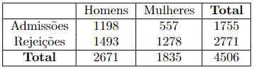
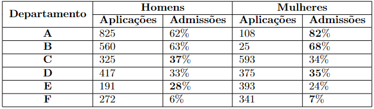

# Exercicio 1 (1,5 pontos)

**Encontre os estimadores de mínimos quadrados da regressão linear múltipla. Calcule a esperança e variância desse vetor.**

```{r, echo=FALSE, out.width = '40%'}
library(knitr)
knitr::include_graphics("questao1_p2_1.png")
```

```{r, echo=FALSE, out.width = '40%'}
library(knitr)
knitr::include_graphics("questao1_p2_2.png")
```

```{r, echo=FALSE, out.width = '40%'}
library(knitr)
knitr::include_graphics("questao1_p2_3.png")
``` 
# Exercicio 2 (0,5 pontos)

**O que é multicolinearidade? Quais suas consequências quando estimamos um modelo linear?**

Multicolinearidade consiste em um problema comum em regressões, no qual as variáveis independentes possuem relações lineares exatas ou aproximadamente exatas. O indício mais claro da existência da multicolinearidade é quando o $R^2$ é bastante alto, mas nenhum dos coeficientes da regressão é estatisticamente significativo segundo a estatística T. 

As consequências são a de erros-padrão elevados no caso de multicolinearidade e até mesmo a impossibilidade de qualquer estimação.

# Exercicio 3 (0,5 pontos)

**O que acontece com o $R^2$ quando mais covariáveis são adicionadas ao modelo?**

**Explique o por que dessa propriedade?**

O $R^2$ é uma função não decrescente do número de parâmetros. Ou seja, sempre que incluirmos mais uma variável no modelo, o $R^2$ irá aumentar ou continuar o mesmo, caso a covariável não explique nada. 

Temos essa propriedade pois com o número de covariáveis aumentando, as informações do nosso modelo só podem aumentar ou continuar as mesmas, pois não perdemos informação adicionando uma variável, o que explica o nosso coeficiente de determinação só poder aumentar ou continuar o mesmo.

# Exercicio 4 (0,5 pontos)

Responda Verdadeiro ou Falso e justifique a sua resposta:

**a) O teste de Durbin-watson é utilizado para verificar se os resíduos são homocedásticos.**

Falso. O teste de Breusch-Pagan é utilizado para verificar se os resíduos são homocedásticos. O teste de Durbin-Watson verifica a presença de autocorrelação nos erros de um modelo.

**b) A multicolinearidade é um problema que ocorre quando os resíduos são correlacionados.**

Falso. A multicolinearidade é um problema que ocorre quando temos correlações entre as variáveis. 

**c) Heterocedasticidade ocorre quando o erro aleatório em um modelo de regressão não possui distribuição normal.**

Falso. A heterocedasticidade ocorre quando a variância dos erros não é constante em um modelo de regressão.

# Exercicio 5 (0,5 pontos)

**Cite um exemplo aplicado do paradoxo de simpson.**

Um dos exemplos mais conhecidos desse paradoxo, citado na aula 24, ocorreu em 1973 na Universidade de Berkeley, na Califórnia.

Abaixo, a tabela com o número de candidaturas para egresso na Universidade de Berkeley e o número de admissões dado o sexo.

```{r, echo=FALSE, out.width = '40%'}
library(knitr)

``` 

Parece que as candidatas do sexo feminino eram menos propensas a serem aceitas do que os homens. A diferença foi tão grande que não poderia ser devido ao acaso.

A porcentagem de admissões foi de $44,85\%$ para os homens e $30,35\%$ para mulheres.

Diante desses dados, uma jovem cujo pedido de admissão tinha acabado de ser rejeitado entrou com um processo de discriminação contra a universidade.

No entanto, quando os dados de cada departamento foram analisados, em nenhum caso houve evidência de viés contra as candidatas do sexo feminino.

```{r, echo=FALSE, out.width = '55%'}
library(knitr)

``` 

Como podemos ver, considerar uma informação pode mudar totalmente a interpretação do modelo. Por isso, é sempre importante considerar a presença de variáveis confundidoras, que quando agregadas à análise podem mudar e muito os resultados do modelo.

# Exercicio 6 (4,5 pontos)

```{r, message=FALSE, warning=FALSE, echo=FALSE, include=FALSE}
library(ggplot2)
library(knitr)
library(ggfortify)
library(HistData)
library(plotly)
library(tidyr)
library(pastecs)
library(gridExtra)
library(lmtest)
library(nortest)
library(GGally)
library(corrplot)
```

Para o exercício abaixo será necessário o uso do banco de dados do R _teengamble_ do pacote _faraway_. 

O objetivo do exercício é estimar quanto jovens gastam em apostas dado as variáveis status socioeconomico dos pais, sexo e renda. 

```{r, message=FALSE, warning=FALSE}
require(faraway)
library(tidyverse)

dados = teengamb
```

**a) Faça a análise gráfica dos dados.**

Primeiro, deixamos a variável sexo como *factor* e selecionamos as variáveis que serão utilizadas: *gamble* (gasto em apostas), *status* (status socioeconômico dos pais), *sex* (sexo) e *income* (renda).

```{r, message=FALSE, warning=FALSE}

dados$sex <- as.factor(dados$sex)
dados <- select(dados, gamble, sex, status, income)
```

Então, identificamos NAs e possíveis erros de digitação.

```{r, message=FALSE, warning=FALSE, echo=FALSE, include=TRUE}

kable(sapply(dados, function(x) sum(is.na(x))), align = "c", caption = "Quantidade de observações NAs no banco de dados")
```

Como podemos ver, não há nenhum NA.

Agora, será feita uma tabela de frequências do sexo das pessoas. Temos para o valor 0 o sexo masculino e para o valor 1 o sexo feminino, conforme descrição do banco de dados. Com isso, podemos ver o número de pessoas separadas pelo sexo.

```{r, message=FALSE, warning=FALSE, echo=FALSE, include=TRUE}
kable(table(dados$sex), align = "c", 
      caption = "Tabela de frequências para a variável 'sex' ", 
      col.names = c("Sexo", "Frequência"))
```

Com isso, vamos mostrar as principais estatísticas descritivas do banco de dados, com exceção da variável *sex*, que é um fator.

```{r, message=FALSE, warning=FALSE, echo=FALSE, include=TRUE}
aux1 <- stat.desc(dados[,c(1,3:4)]); aux1 <- aux1[c(4,5,8,9,12:14),]
rownames(aux1) <- c("Mínimo","Máximo","Mediana","Média","Variância","Desvio Padrão","Coeficiente de Variação")
kable(aux1, digits = 1, align = "c", caption = "Principais Estatísticas descritivas do banco de dados")
```

Com isso, vamos para os gráficos:

```{r message=FALSE, warning=FALSE}
ggpairs(dados,columns = c(1,3:4))
```

Como podemos ver nos gráficos de densidade, os valores de apostas se concentram mais pra valores mais baixos, os valores de status se concentram mais entre os valores centrais porém temos uma faixa mais aberta em relação aos valores das apostas, e por fim a densidade da renda nos diz que temos mais concentração nos valores mais baixos também. 

Em relação aos gráficos de pontos, vemos uma correlação maior das apostas em relação ao valor da renda, do que a correlação das apostas com o status sócio econômico, porém não temos correlações fortes entre elas.

```{r message=FALSE, warning=FALSE}
ggplot(dados) +
  geom_point(mapping = aes(x = status, y = gamble, size = sex, alpha = income),color="blue")
```

A partir do gráfico de pontos com o eixo Y sendo o valor de apostas, o eixo X sendo o status sócio-econômico, a cor do ponto sendo o valor da renda e o tamanho da bolinha sendo o sexo da pessoa, podemos ver que temos uma concentração de mulheres em apostas até 25 pesos por ano, enquanto os homens tem apostas mais altas. 

Também podemos ver que o status das mulheres estão mais concentrados em relação ao dos homens, com os homens parecendo ter os status sócio-econômicos mais altos em relação às mulheres, quando temos os valores de apostas parecidos.

```{r message=FALSE, warning=FALSE}
plot_ly(dados, x = ~income, y = ~status, z = ~gamble) %>%
  add_markers(color = ~sex) %>%
  layout(scene = list(xaxis = list(title = 'status'),
                     yaxis = list(title = 'income'),
                     zaxis = list(title = 'gamble')))
```

Por fim, temos um gráfico de densidade tridimensional, onde as cores dos pontos definem o sexo da pessoa, a variável X é o status sócio-econômico, Y é a renda e Z é o valor em apostas.

**b) Quais coeficientes estimados do modelo foram significativos? Interprete o valor do $R^2$ adequado.**

Temos o seguinte modelo:

```{r message=FALSE, warning=FALSE}
modelo = lm(gamble ~ status + sex + income, data = dados)
summary(modelo)
```

Como podemos ver logo acima, os coeficientes significativos para o modelo estimado foram o sexo feminino e o valor da renda, com p-valores menores que $0,05$. O coeficiente do status sócio-econômico e o do intercepto não foram significativos.

Na interpretação do $R^2$, devemos interpretar o valor do $R^2$ ajustado, que relaciona a complexidade do modelo com a explicação dos coeficientes em relação a variável que queremos predizer (nesse caso, quanto menos variáveis, maior o $R^2$ ajustado). Como podemos ver, temos um $R^2$ ajustado igual a $0,4713$. Isso quer dizer que nosso modelo explica $47,13\%$ da variável aposta a partir das variáveis status sócio-econômico, sexo e renda.
 
**c) Interprete as estimativas para os parâmetros, escreva a equação do modelo completo e as equações das retas separadas para cada um dos sexos.**

Para o modelo, temos a equação:

$y_i=\beta_0+\beta_1\cdot status+\alpha_1\cdot sex+\beta_2\cdot income$

onde:

$\beta_0=13,03$: é o intercepto da nossa reta. Ele não tem uma interpretação, pois nenhuma pessoa tem 0 de status, então serve como variável suporte. 

$\beta_1=-0,1496$: mantendo o sexo e a renda constantes, para unidade de variação no status sócio-econômico, espera-se que o valor de apostas diminuirá em $0,1496$ libras por ano. Porém, não temos significância nessa variável.

$\alpha_1=-24,34$: mantendo o status sócio-econômico e a renda constantes, espera-se que o valor de apostas das mulheres seja $24,34$ libras por ano a menos que a o valor de apostas dos homens.

$\beta_2=4,93$: mantendo o status sócio-econômico e o sexo constantes, para unidade de variação na renda, espera-se que o valor de apostas aumentará em $4,93$ libras por ano.

Com isso, temos a seguinte equação:

$y_i=13,03-0,1496\cdot status-24,34\cdot sex+4,93\cdot income$

Agora, na equação para os sexos temos:

**Masculino**

Para o sexo masculino, temos a variável *sex* igual a 0. Então:

$y_i=13,03-0,1496\cdot status+4,93\cdot income$

**Feminino**

Para o sexo feminino, temos a variável *sex* igual a 1. Então:

$y_i=-11,31-0,1496\cdot status+4,93\cdot income$

**d) Faça o gráfico do modelo encontrado em (c) para gamble dado income e sex.** 

```{r message=FALSE, warning=FALSE}
ggplot(dados) +
geom_point(aes(x = income, y = gamble, color = sex)) +
geom_line(aes(x = income, y = predict(modelo), group = sex, color = sex), lwd = 1.5) + 
scale_color_manual(breaks = c("0","1"),values=c("blue","red"))
```

Observando o gráfico do modelo para o valor das apostas dado a renda e o sexo, temos que o sexo masculino tem valores preditos maiores que o feminino.  Também podemos ver que a renda tem um intervalo maior de valores para o sexo masculino do que para o sexo feminino. Por último podemos ver que quanto maior a renda, maior o valor de aposta para ambos os sexos.

**e) Há multicolinearidade entre as variáveis preditoras? Quais os indícios que corroboram com sua resposta?**

```{r message=FALSE, warning=FALSE}
corrplot.mixed(cor(dados[,c(1,3:4)]), lower.col = 'black', number.cex = .7)
```

A partir do gráfico, podemos ver que a correlação entre as variáveis não é forte para nenhum dos casos, dando indícios que não há multicolinearidade. Agora, calculamos o valor do VIF para verificar se a variância dos estimadores estão ou não infladas pela aparição das outras covariáveis:

```{r, message=FALSE, warning=FALSE, echo=FALSE, include=TRUE}
kable(vif(modelo), align = "c", 
      caption = "VIF para as variáveis explicativas do modelo")
```

Como podemos analisar, o VIF é menor que 10 para as três variáveis. 

Ou seja, concluímos, a partir do que temos, que não há multicolinearidade entre as variáveis preditoras, pois temos correlações fracas indicadas pela tabela das correlações e o nosso VIF diz que a variância dos estimadores não está inflada pela aparição das outras covariáveis.

**f) Faça a análise dos resíduos e verifique as suposiçoes do modelo.**

#### Normalidade

```{r, message=FALSE, warning=FALSE, echo=FALSE, include=TRUE}
ggplot(mapping = aes(x = modelo$residuals)) + 
  geom_histogram() +
  xlab("Residuals") + 
  ylab(" ")

autoplot(modelo, which = 2, label.size = 3)
```

De acordo com o histograma e o Q-Q plot, temos um indício de que os resíduos não seguem normalidade. Agora, serão feitos os testes para concluirmos sobre a normalidade ou não dos dados.

```{r, message=FALSE, warning=FALSE, echo=FALSE, include=TRUE}
norm.test.stat = c(shapiro.test(modelo$residuals)$statistic, 
                   ks.test(modelo$residuals, "pnorm")$statistic, 
                   ad.test(modelo$residuals)$statistic, 
                   cvm.test(modelo$residuals)$statistic)

norm.test.pvalue = c(shapiro.test(modelo$residuals)$p.value, 
                   ks.test(modelo$residuals, "pnorm")$p.value, 
                   ad.test(modelo$residuals)$p.value, 
                   cvm.test(modelo$residuals)$p.value)

norm.test = cbind(norm.test.stat, norm.test.pvalue)

rownames(norm.test) = c("Shapiro-Wilk", "Kolmogorov-Smirnov", 
                        "Anderson-Darling", "Cramer-Von-Mises")
colnames(norm.test) = c("Statistic", "P.value")

kable(norm.test, align = "c", 
      caption = "Testes de normalidade")
```

Como podemos ver, todos os testes rejeitam a normalidade dos dados, com p-valores menores do que $0,05$.

Então, podemos concluir, a partir dos gráficos e dos testes feitos, que não temos normalidade nos resíduos, ou seja, os resíduos não seguem uma distribuição normal.

#### Homocedasticidade

```{r, message=FALSE, warning=FALSE, echo=FALSE, include=TRUE}
autoplot(modelo, which = 1, label.size = 3)

homo.test = cbind(bptest(modelo, studentize = FALSE)$statistic, 
                  bptest(modelo, studentize = FALSE)$p.value)

rownames(homo.test) = c("Breusch-Pagan")
colnames(homo.test) = c("Statistic", "P.value")

kable(homo.test, align = "c", caption = "Teste de homocedasticidade")
```

A partir do gráfico, temos indícios de uma heterocedasticidade dos resíduos. O teste de Breusch-Pagan também não aceita homocedasticidade dos resíduos.

Então, dada as evidências indicadas, podemos dizer que os resíduos são heterocedásticos, ou seja, não possuem homocedasticidade e os erros não possuem variância constante.

**g) Verifique se o banco de dados apresenta outliers, pontos de alavanca e pontos influentes. Se houver um ponto influente, identifique essa observação indicando os valores observados para a variável resposta e para as covariáveis.**

#### Outliers

Os outliers não se ajustam bem ao modelo. É a observação com valor discrepante de Y, ou seja, o valor ajustado $\hat{Y}_i$ é muito distante de $Y_i$ e consequentemente o resíduo $\hat{e}_i$ é grande. Um outlier só deve ser excluído se um erro é identificado.

```{r, warning=FALSE, message=FALSE, echo=FALSE, include=TRUE}
autoplot(modelo, which = 3, label.size = 3)
```

Os pontos sinalizados, as observações 24, 36 e a 39, são considerados outliers.

#### Ponto de Alavanca

Os pontos de Alavanca tem valor não usual da variável explicativa. Eles não necessariamente afetam a reta de regressão.

```{r, warning=FALSE, message=FALSE, echo=FALSE, include=TRUE}
autoplot(modelo, which = 5, label.size = 3)
```

Aqui também os pontos estão assinalados, ou seja, os pontos 5, 24 e 39 são pontos de alavanca.

#### Pontos influentes

Os pontos influentes quando presentes, mudam o ajuste do modelo substancialmente. É um outlier ou/e ponto de alavanca. A medida mais usada para detectar tais pontos é a distância de cook.

Se um outlier/alavanca for influente, ele interfere sobre a função de regressão ajustada (a inclusão ou não do ponto modifica substancialmente os valores ajustados), mas uma observação ser considerada um outlier/alavanca não quer dizer que consequentemente é um ponto influente. Por isso, um ponto pode ser um outlier/alavanca em relação a Y ou aos X e pode ou não ser um ponto influente.

```{r, warning=FALSE, message=FALSE, echo=FALSE, include=TRUE}
autoplot(modelo, which = 4, label.size = 3)
```

O gráfico da distância de cook sinalizou que as observações 5, 24 e 39 são pontos influentes, ou seja, que interferem e mudam muito a reta de regressão estimada. Podemos notar, que dos pontos de outlier e alavanca encontrados acima, somente a observação 36 não é um ponto influente (apesar de ser um outlier). 

Abaixo, temos as observações 5, 24 e 39, que são outliers, com os valores observados para a variável resposta e para as covariáveis: 

```{r, warning=FALSE, message=FALSE, echo=FALSE, include=TRUE}
aux.inf = dados[c(5,24,39), c(1:4)]

kable(aux.inf, align = "c", 
      caption = "Pontos influentes do modelo de regressão")
```

**h) Você faria algum tipo de transformação nesses dados se sim, qual?**

Poderiamos fazer transformações devido a não normalidade, não homocesticidade dos resíduos e também por termos pontos influentes, justamente para corrigir isso.

Para isso acontecer, poderíamos fazer transformações em $Y$. Alguns exemplos de transformações são: 

- $Y^*=\sqrt{Y}$

- $Y^*=\arcsin{Y}$

- $Y^*=\ln{Y}$

- $Y^*=\frac{1}{\sqrt{Y}}$

- $Y^*=\frac{1}{Y}$

Também poderíamos utilizar o procedimento de Box-Cox que é um método para escolher transformações de maneira automática. Essas transformações são escolhidas na família de transformações potência.

A transformação pensada para esse caso pode ser $Y*=\ln{Y}$, já que é uma das transformações para estabilizar a variância quando ela cresce mais rapidamente com $Y$.

# Exercício 7 (1 ponto extra)

1) Faça um usuário no github (se você já tem um usuário, desconsidere essa parte);
2) Crie o repositório privado (provas_modelos_lineares) (se você já fez esse repositorio, desconsidere essa parte);
3) Faça o meu usuário do github (marcia-barbian) ter acesso ao repositório;
4) Coloque os arquivos da sua prova2 no repositório.